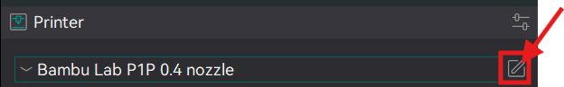
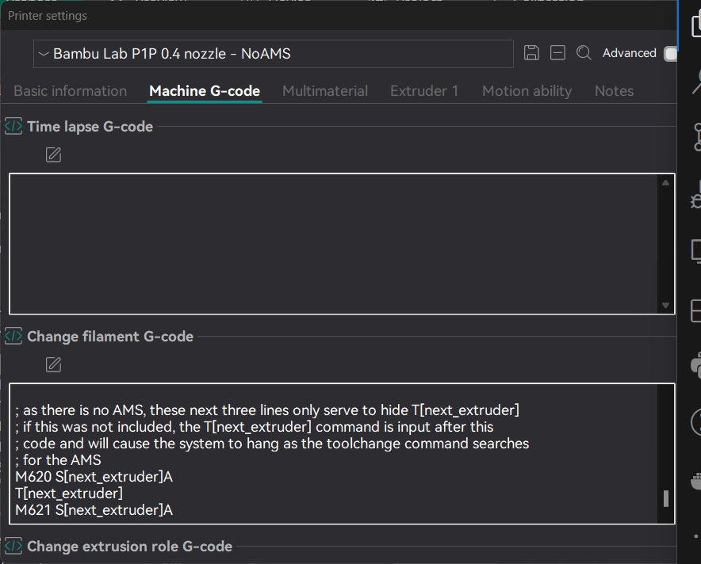
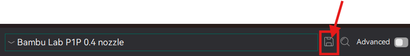
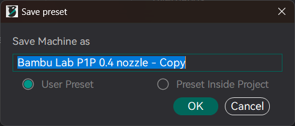

# Change Filament Color Gcode

## Introduction
These are instructions on how to setup Orca Slicer to manually change colors during a print with no AMS.

## Requirements

- [Orca Slicer V2.3.0](https://github.com/SoftFever/OrcaSlicer/releases/tag/v2.3.0)
- Custom GCODE: [change-filament-no-ams.gcode](./change-filament-no-ams.gcode)

## Setup

1. Open the Printer settings for the installed nozzel size, in this example `Bambu Lab P1P 0.4` using the menu icon next to the settings text.

    

2. Navigate to the `Machine G-code` tab.
3. Scroll down to the `Change Filament G-code` field.
4. Replace the text with the text in the file: [change-filament-no-ams.gcode](./change-filament-no-ams.gcode)

    

5. Press the `Save Icon` 
    

6. Set the desired Name, I choose to relace `Copy` with `No-AMS`

    

